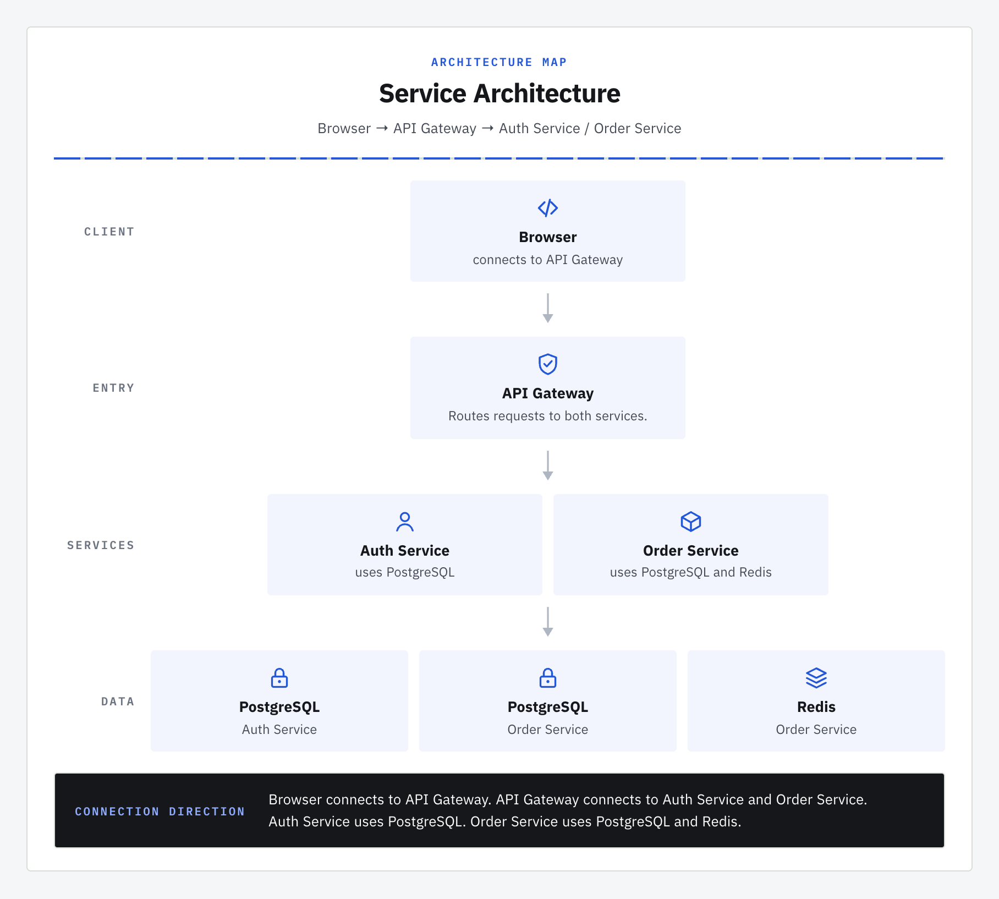
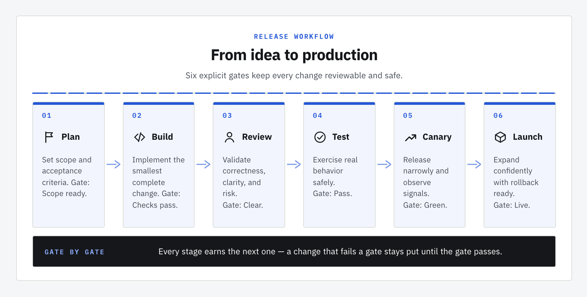
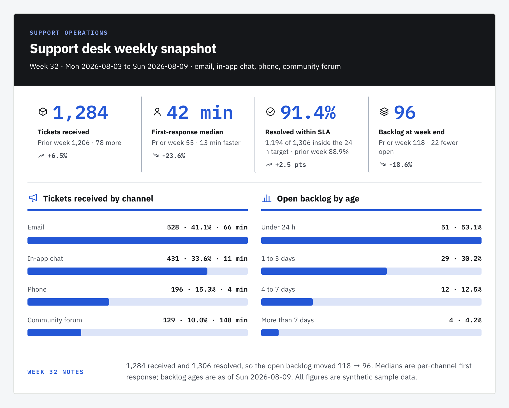
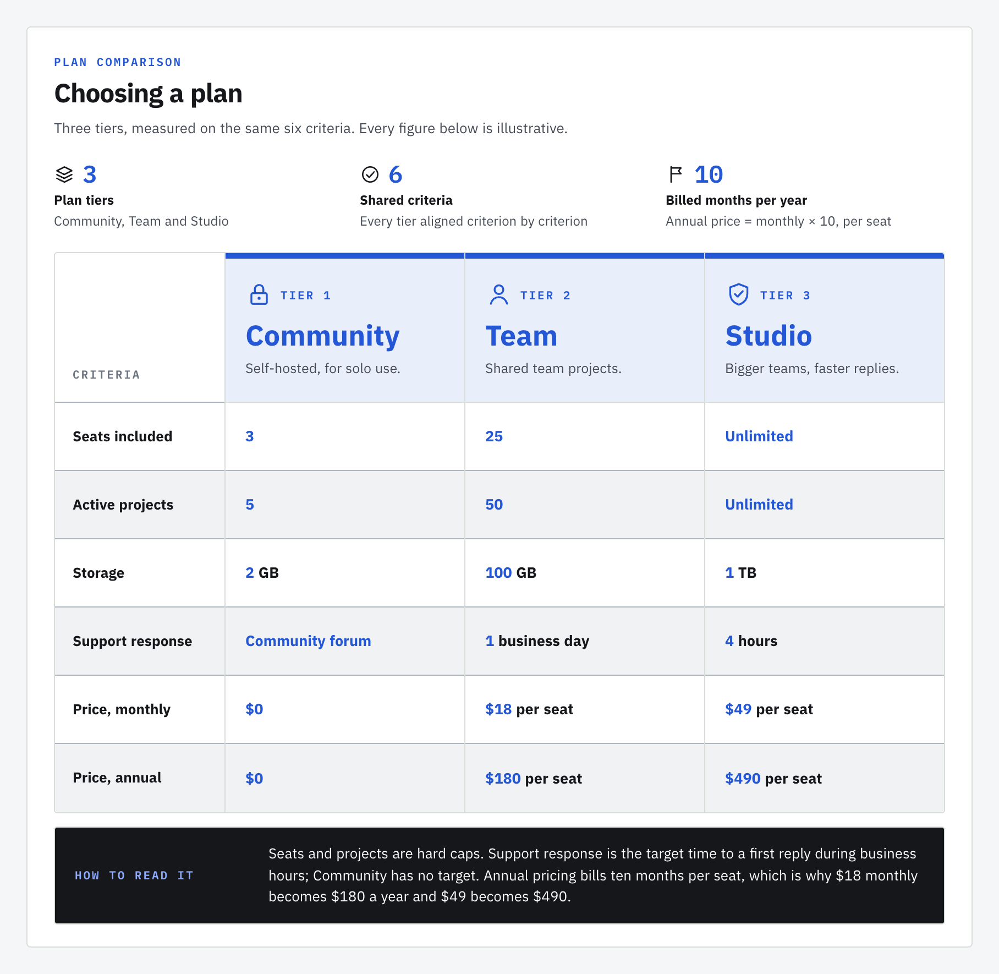
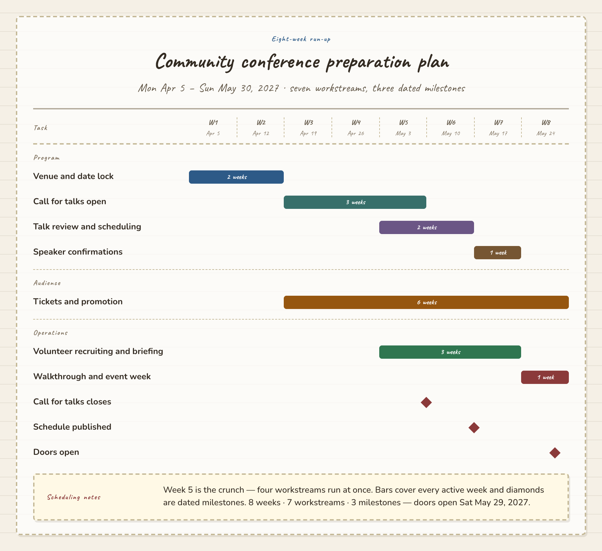

<div align="center">
  
  <p><strong>Turn a technical explanation into a diagram for your README or RFC.</strong><br>
  Chinese and English · self-contained HTML · PNG when you ask for it</p>
  <p>
    <a href="./README.zh-CN.md">简体中文</a>
    · <a href="https://godvvvzzz.github.io/text2html2png/">See examples</a>
    · <a href="#quick-start">Quick start</a>
    · <a href="#try-the-renderer-without-an-agent">Local playground</a>
    · <a href="./CONTRIBUTING.md">Contributing</a>
  </p>
  <p>
    <a href="https://github.com/GODVvVZzz/text2html2png/stargazers"></a>
    <a href="https://github.com/GODVvVZzz/text2html2png/actions/workflows/ci.yml"></a>
    <a href="./LICENSE"></a>
    
  </p>
</div>

An agent skill for turning system descriptions, release plans, and technical notes into static visuals. Your agent organizes the content; a local renderer builds the diagram, embeds its fonts, and checks its layout in a browser.

## One paragraph in, a system overview out

Copy this prompt into an agent with the skill installed:

```text
Use text2html2png to create a clean architecture diagram for our README.
Browser → API Gateway → Auth Service and Order Service.
Auth Service uses its own PostgreSQL database. Order Service uses a separate PostgreSQL database and its own Redis.
Do not add cloud providers, protocols, ports, or metrics.
Save the HTML and Diagram JSON, and also export a PNG.
```

<div align="center">
  <a href="https://godvvvzzz.github.io/text2html2png/examples/service-architecture-en.html"></a>
</div>

**[Open the HTML](https://godvvvzzz.github.io/text2html2png/examples/service-architecture-en.html)** · [PNG](./skills/text2html2png/assets/gallery/service-architecture-en-clean.png) · [Complete Diagram JSON](./docs/examples/service-architecture-en.diagram.json) · [Chinese example](https://godvvvzzz.github.io/text2html2png/examples/service-architecture-zh.html)

The architecture layout shows adjacent layers with downward arrows; node descriptions and the footer name the specific dependencies. It is a layered overview, not an arbitrary graph editor. The committed JSON reproduces this example; an agent may organize the same prose differently.

For a longer technical description, see the [order events example](https://godvvvzzz.github.io/text2html2png/examples/order-event-architecture-en.html): three layers and nine nodes retain synchronous requests, asynchronous event routes, three database owners, and delivery boundaries. The [source request](./skills/text2html2png/examples/order-event-architecture.meta.json) and [complete JSON](./docs/examples/order-event-architecture-en.diagram.json) are public. This is a synthetic design example, not a customer system or performance benchmark.

## Quick start

Install the skill:

```bash
npx skills add GODVvVZzz/text2html2png -g -y
```

Then send the prompt above to your agent, or replace the service description with your own material. To target an agent explicitly:

```bash
npx skills add GODVvVZzz/text2html2png -g -a codex -y
npx skills add GODVvVZzz/text2html2png -g -a claude-code -y
```

| Output | When you receive it | What to do with it |
|---|---|---|
| Self-contained `.html` | Default | Open in a browser or keep with your project |
| `.png` | Say **“also export a PNG”** | Paste into a README, RFC, issue, slide, or chat |
| `.diagram.json` | Kept alongside HTML | Edit the content or theme and render again |

To revise a diagram, ask your agent to update the JSON and regenerate it. The HTML is a standalone output; the JSON is the reusable source.

**Requirements:** Node.js 22.12+ to render HTML; a local Chrome, Chromium, Edge, or Brave installation for the required browser layout check and optional PNG export. Before the first render, the agent runs `npm ci --omit=dev` inside the installed skill directory. This installs the lockfile's dependencies, including fonts, `subset-font`, and `puppeteer-core`. It uses your existing browser without downloading another one. The first install needs network access.

## Try the renderer without an agent

**No installation:** open the [example gallery](https://godvvvzzz.github.io/text2html2png/) to compare source prompts with finished diagrams, switch between Chinese and English, and download HTML, PNG, or complete Diagram JSON. This is a static showcase of prepared examples; it does not send prompts to a model or generate diagrams from new prose.

**Edit locally:** clone the repository, install dependencies, and start the playground:

```bash
git clone https://github.com/GODVvVZzz/text2html2png.git
cd text2html2png/skills/text2html2png
npm ci
npm run playground
```

Open the address printed in the terminal. Load one of the nine chart examples, edit its **Diagram JSON**, preview it, and download HTML or an audited PNG. The playground and renderer need no model API key; natural-language interpretation happens in your agent.

In another terminal, from `text2html2png/skills/text2html2png`, reproduce the architecture example:

```bash
npm run render -- --input ../../docs/examples/service-architecture-en.diagram.json --html architecture.html --audit
```

For the image too:

```bash
npm run render -- --input ../../docs/examples/service-architecture-en.diagram.json --html architecture.html --png architecture.png --force
```

`--png` also runs the strict layout audit. `--force` explicitly replaces an existing output; omit it for new filenames. Use `--chrome /path/to/browser` or `CHROME_PATH` if browser discovery needs help.

## More than architecture

|  |  |
|---|---|
| **Explain a release process** · `clean`<br><br>[HTML preview](https://godvvvzzz.github.io/text2html2png/examples/release-flow-en.html) | **Report supplied KPIs** · `clean`<br><br>[HTML preview](https://godvvvzzz.github.io/text2html2png/examples/support-snapshot-en.html) |
| **Compare technical options** · `clean`<br><br>[HTML preview](https://godvvvzzz.github.io/text2html2png/examples/plan-comparison-en.html) | **Plan a launch** · `notebook`<br><br>[HTML preview](https://godvvvzzz.github.io/text2html2png/examples/launch-plan-en.html) |

Every example includes Chinese and English fixtures. All example data is synthetic; see [asset provenance](./ASSET_PROVENANCE.md). Browse the [gallery](https://godvvvzzz.github.io/text2html2png/) for the source prompts and downloadable outputs.

| Chart | Best for |
|---|---|
| Architecture | Layered system overviews with named dependencies |
| Flowchart | Step-by-step processes and release gates |
| Comparison | Alternatives aligned on shared criteria |
| Timeline | Milestones, history, roadmaps |
| Dashboard | KPIs and status metrics you supply |
| Gantt | Tasks with dates or durations |
| Org chart | Reporting lines and category hierarchies |
| Funnel | Stage volumes and conversion you supply |
| Narrative brief | PRDs, proposals, and review notes on one page |

Five themes: **clean** (default), **editorial**, **notebook**, **warm**, and **glass**. All 45 chart/theme combinations are supported by the shared rendering contract. The published examples cover a subset; support does not mean every combination has a visual regression baseline.

## Why the output is consistent

```text
Your text → Agent → Diagram JSON → Local renderer → HTML → Browser check → Optional PNG
```

- **Reusable source.** The same JSON, renderer, and installed dependencies produce the same HTML. PNG pixels also depend on the browser and platform rasterizer.
- **Chinese and English fonts.** Fonts are installed locally, subset to the characters used, and embedded in the output. Opening a generated diagram does not need a font CDN.
- **Measured layout.** Browser checks catch clipped, obscured, overlapping, or invisible text; cropped connectors; small type; low contrast; and awkward short-label wrapping, including CJK orphan characters. The agent also inspects the result for meaning and readability.
- **Facts stay with the source.** The skill instructs the agent to preserve supplied facts and relationships and avoid inventing metrics, dates, people, or infrastructure. Review the result against your input, especially for complex systems.

`npm run check:layout` rebuilds and audits every published example. Warnings and errors both fail the gate. Findings identify an element, measurements, and a suggested repair; fixes belong in the JSON or shared renderer, followed by another audit.

For the full workflow, read [SKILL.md](./skills/text2html2png/SKILL.md), the [Diagram JSON reference](./skills/text2html2png/references/diagram-json.md), and the [rendering contract](./skills/text2html2png/references/rendering-contract.md).

## Privacy and boundaries

Rendering runs locally with no project backend, account, or telemetry. Browser audits and PNG export block page network requests and page JavaScript by default, validate the HTML, and keep the Chrome sandbox enabled. Dependency installation uses your npm registry. Your agent's handling of conversation content depends on the agent and model service you choose; local rendering does not change that.

Read [PRIVACY.md](./PRIVACY.md) and [SECURITY.md](./SECURITY.md) for details. The renderer is intended for generated or explicitly trusted HTML.

| You need | Use |
|---|---|
| A static diagram for a document, issue, or chat | **text2html2png** |
| Arbitrary graph routing or editable Mermaid / draw.io / Excalidraw source | A tool designed for that format |
| Clickable, explorable system maps | An interactive diagram tool |
| Statistical or scientific plots, or maps | A visualization library on the real dataset |
| Editable vector output for a designer | A vector editor; SVG export is not implemented |

## Development

```text
skills/text2html2png/
├── SKILL.md       Agent workflow and output contract
├── references/    Chart guides, themes, and rendering rules
├── schemas/       Diagram JSON and configuration schemas
├── examples/      Bilingual source fixtures and generated HTML
├── scripts/       Renderer, local playground, audit, and batch tools
└── tests/         Unit tests and browser checks
docs/             Static gallery and downloadable examples
```

The standard `skills/` layout works with `npx skills`. The Codex plugin manifest packages the same canonical skill.

From the repository root:

```bash
cd skills/text2html2png
npm ci
npm run check
```

The checks cover skill metadata, theme contracts, example structure, privacy patterns, safe HTML, CLI behavior, browser screenshots, and layout audits. A working browser is required for the full check. Some browser tests skip when no browser can launch; a passing `npm test` alone is not a full visual check.

| Command (inside the skill directory) | Purpose |
|---|---|
| `npm run check:layout` | Rebuild and audit all published examples |
| `npm run render:examples` | Rebuild example HTML and gallery PNGs |
| `npm run audit:layout -- --html x.html --width 1040 --json` | Audit one document at its render width |
| `node ../../scripts/build-gallery.mjs` | Regenerate the static gallery, downloads, and prompt index |
| `node ../../scripts/check-links.mjs` | Check local documentation links |

For a trusted isolated container that cannot support the browser sandbox, the example builder accepts `--no-sandbox`: `node scripts/build-examples.mjs --audit --no-sandbox`.

See [CONTRIBUTING.md](./CONTRIBUTING.md) for contribution checks, [acceptance notes](./docs/ACCEPTANCE.zh-CN.md), and the [theme/chart orthogonality proof](./experiments/theme-decoupling/README.md) for rendering design and development fixtures.

## Roadmap

- Richer chart-specific JSON validation and migration tooling
- More dense Chinese/English fixtures across chart and theme combinations
- SVG export
- Community examples with explicit rights and privacy confirmation

## License

MIT. See [LICENSE](./LICENSE).
