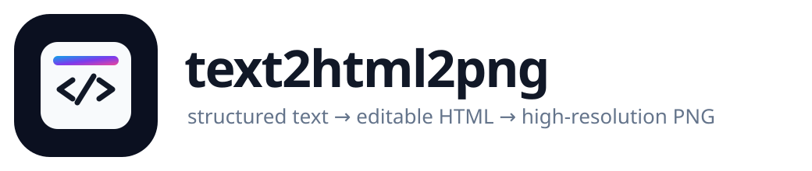
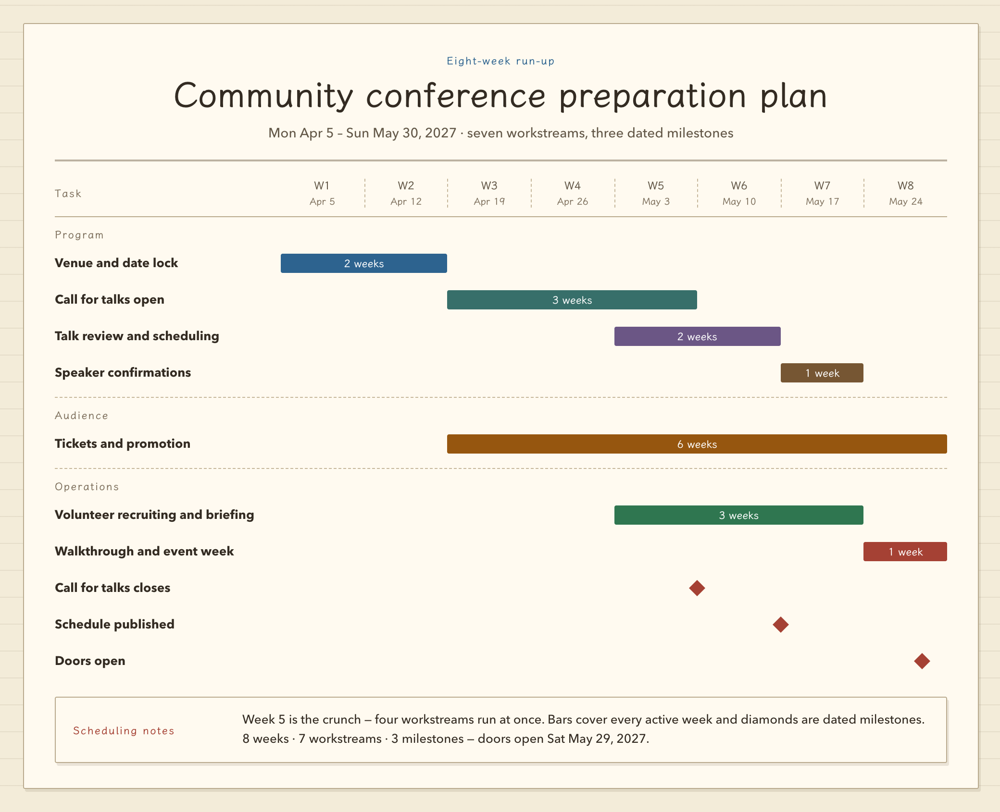
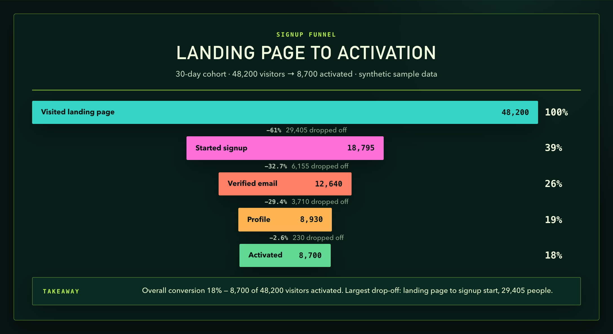
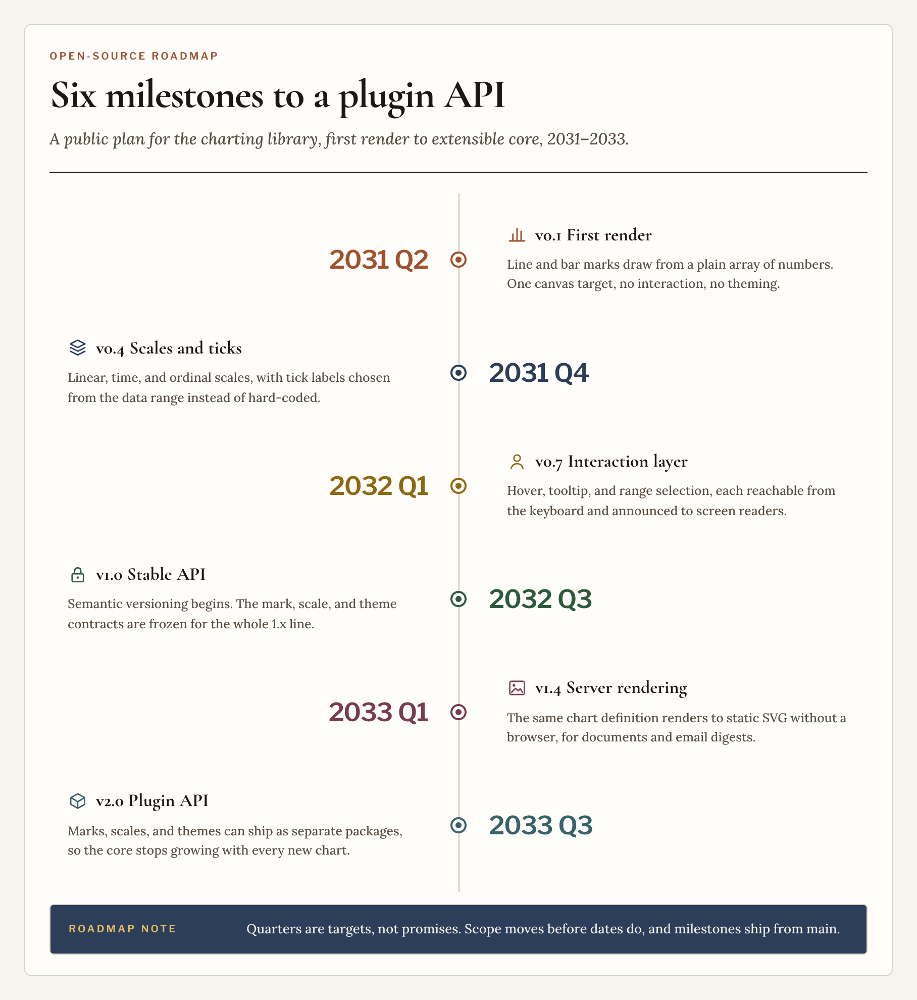
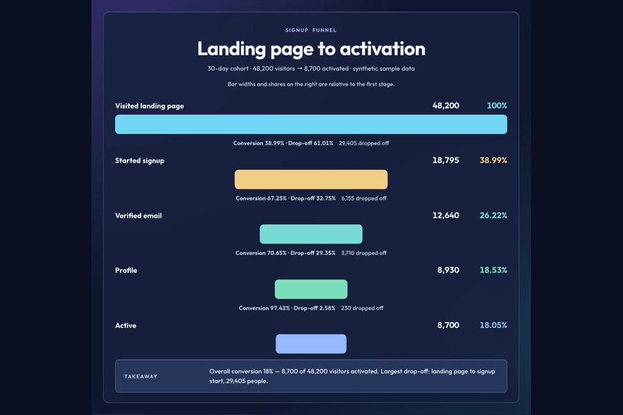
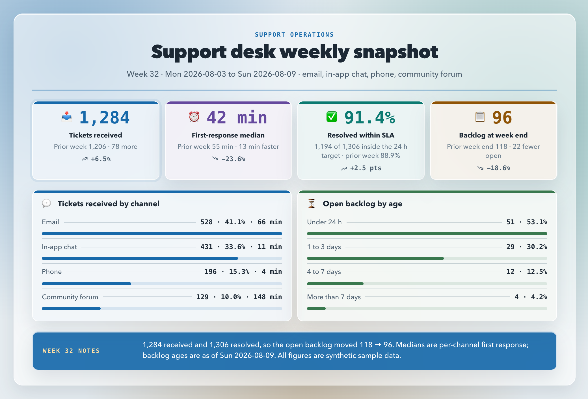
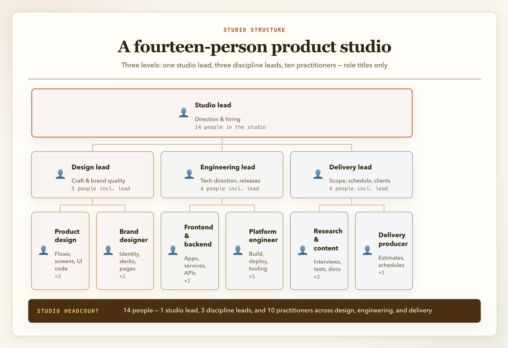

<div align="center">
  
  <p><strong>Turn any text into a paste-ready diagram.</strong><br>
  Every render is editable HTML; PNG export is one request away. Nothing leaves your machine.</p>
  <p>
    <a href="./README.zh-CN.md">简体中文</a>
    ·
    <a href="https://godvvvzzz.github.io/text2html2png/">Gallery</a>
    ·
    <a href="#quick-start">Quick start</a>
    ·
    <a href="#why-the-output-is-consistent">How quality is enforced</a>
    ·
    <a href="./CONTRIBUTING.md">Contributing</a>
  </p>
  <p>
    <a href="https://github.com/GODVvVZzz/text2html2png/stargazers"></a>
    <a href="https://github.com/GODVvVZzz/text2html2png/actions/workflows/ci.yml"></a>
    <a href="./LICENSE"></a>
    
    
  </p>
</div>

<div align="center">
  
  
  
</div>

Most diagram tools ask you to draw. This one asks you to describe. You paste a plan, a spec, a meeting note, or a set of numbers; your agent picks the right chart, keeps your facts intact, and hands you a paste-ready image — backed by a self-contained HTML document you can restyle and keep. Carbon and ray.so do this for code snippets; this skill does it for any structured text. When you explicitly need the picture, it renders a tightly cropped PNG in the browser you already have.

- **9 chart types** — flowchart, comparison, timeline, architecture, dashboard, Gantt, org chart, funnel, narrative brief
- **7 visual themes** — warm, dark, minimal, editorial, neon, paper, glass
- **A picture you can paste, a document you can keep** — the deliverable is one editable HTML file; say “also export a PNG” or pass `--png` when you want the image itself
- **Measured, not hoped for** — a browser-based layout audit is a required step of the workflow and a CI gate for every published example
- **Local-first** — no hosted rendering API, no API key, no telemetry, network blocked during render

## Quick start

```bash
npx skills add GODVvVZzz/text2html2png -g -y
```

Then ask your agent, in plain language:

> Turn our launch plan into a Gantt chart: research weeks 1–2, design weeks 2–4, build weeks 4–7, beta week 8. Use the paper theme.

The chart arrives as an editable `.html` file — restyle it, tweak the copy, keep it in Git. Add “also export a PNG” or `--png` when you want the paste-ready image too.

The `skills` CLI places the skill for the agent you name. To target one explicitly:

```bash
npx skills add GODVvVZzz/text2html2png -g -a codex -y
npx skills add GODVvVZzz/text2html2png -g -a claude-code -y
```

**Requirements:** Node.js 22.12+ and any Chrome-family browser (Chrome, Chromium, Edge, or Brave) for browser layout auditing or optional PNG export. On the first browser-backed check the skill installs one direct dependency — `puppeteer-core`, pinned with a committed lockfile — inside its own folder. It drives the browser you already have instead of downloading one.

## See the range

<div align="center">
  
</div>

Every frame above is a real committed example, not a mockup. The full set, each with the exact prompt that produced it, lives in the **[gallery](https://godvvvzzz.github.io/text2html2png/)**.

|  |  |
|---|---|
| **Gantt** · `paper`<br><br>[Prompt and HTML](./skills/text2html2png/examples/launch-plan-en.html) | **Dashboard** · `glass`<br><br>[Prompt and HTML](./skills/text2html2png/examples/support-snapshot-en.html) |
| **Org chart** · `warm`<br><br>[Prompt and HTML](./skills/text2html2png/examples/studio-org-en.html) | **Funnel** · `neon`<br><br>[Prompt and HTML](./skills/text2html2png/examples/signup-funnel-en.html) |

Also published: a [warm release flowchart](./skills/text2html2png/examples/release-flow-en.html), an [editorial roadmap timeline](./skills/text2html2png/examples/library-roadmap-en.html), a [minimal comparison table](./skills/text2html2png/examples/plan-comparison-en.html), two dark architecture maps — [a service topology](./skills/text2html2png/examples/service-architecture-en.html) and [the skill's own pipeline](./skills/text2html2png/examples/local-first-pipeline-en.html) — and a [warm narrative brief](./skills/text2html2png/examples/marketplace-prd-en.html) that lays a whole product brief out as one page. Every example also ships in Chinese; all example data is synthetic — see [asset provenance](./ASSET_PROVENANCE.md).

## What it makes

| Chart | Best for |
|---|---|
| Flowchart | Processes, runbooks, decision flows |
| Comparison | Alternatives aligned on shared criteria |
| Timeline | Milestones, history, roadmaps |
| Architecture | Components, boundaries, dependencies |
| Dashboard | KPIs and status metrics you supply |
| Gantt | Tasks with dates or durations |
| Org chart | Reporting lines and category hierarchies |
| Funnel | Stage volumes and conversion you supply |
| Narrative brief | Decision-first documents: PRDs, proposals, review notes |

Any chart can use any theme. A shared style token contract, checked in CI, requires all seven themes to define the same 19 tokens, so `--style neon` on a Gantt chart is a supported request rather than a gamble. Ten of the 63 pairings ship as rendered examples; the rest are supported by the contract but not yet visually regression-tested.

## Why the output is consistent

A model writing HTML by hand cannot see its own mistakes. So the skill measures the rendered page in a real browser before delivery and fails on defects that a source review always misses:

```bash
cd skills/text2html2png
node scripts/audit-layout.mjs --html /path/to/diagram.html --width 1040
```

| Rule | Severity | What it catches |
|---|---|---|
| `CAPTURE_ROOT_MISSING` | error | No single root element to measure and capture |
| `CONTENT_OUT_OF_BOUNDS` | error | An element sticks out of the capture area and would be silently cropped |
| `TEXT_CLIPPED` | error | Overflow crops text the reader needs |
| `TEXT_TRUNCATED` | error | An ellipsis or line clamp hides one of your facts |
| `TEXT_OCCLUDED` | error | Text is buried under an opaque element and absent from the image |
| `TEXT_INVISIBLE` | error | Text colour matches its background closely enough to disappear |
| `SVG_CLIPPED` | error | A connector or arrowhead escapes its `viewBox` and loses its tip |
| `FONT_TOO_SMALL` | error | Rendered type below 10px |
| `FONT_SMALL_FOR_PROSE` | warning | Body copy below 12px |
| `LOW_CONTRAST` | warning | Text below the WCAG ratio for its size |
| `TEXT_OVERLAP` | warning | Two labels collide |
| `EMPTY_FILLER` | warning | A decorated box with nothing in it |
| `ARIA_HIDDEN_TEXT` | warning | Visible text that screen readers will never announce |
| `EXTREME_ASPECT_RATIO` | warning | The canvas is too wide or too tall to read comfortably |

Each finding names the element, the measured evidence, and one concrete repair, so the agent fixes the document instead of guessing. `npm run check:layout` runs the audit in `--strict` mode over all ten published examples, so a warning fails the build just like an error.

This is not theatre. The audit found real defects in the examples this repository already considered finished — 9px labels in one, white text at a 3.2:1 contrast ratio in another, and a legend hidden from screen readers in a third — and the false negatives it once had, including buried and invisible text, are now covered by fixtures in the test suite.

The skill also fills in what you have not decided. Instead of hedging with assumption labels or a round of questions, it makes the best reasonable call and draws it straight in — the chart arrives ready to paste, and anything you disagree with is one message away from being fixed.

## Privacy and security

Browser-audit and optional PNG-export behavior:

- validates a restrictive Content Security Policy in the generated document;
- rejects scripts, event handlers, frames, forms, plugins, and `javascript:` URLs;
- blocks every network request the page attempts, including remote fonts and images;
- disables page JavaScript;
- keeps the Chrome sandbox enabled;
- refuses to overwrite an existing PNG unless `--force` is explicit;
- caps dimensions and total render pixels.

The paste-ready image is rendered only when you ask for it; until then your content stays as an editable HTML file on disk.

Use `--allow-network` only when you actually want remote assets. Use `--no-sandbox` only inside a trusted isolated container. Read [SECURITY.md](./SECURITY.md) before rendering HTML from a source you do not trust, and [PRIVACY.md](./PRIVACY.md) for exactly what does and does not leave your machine.

## When to use something else

Being specific about the boundary is more useful than claiming to cover everything:

| You want | Better choice |
|---|---|
| Diagram source that lives in Git and diffs cleanly | Mermaid, D2, or PlantUML |
| A clickable, explorable system map | An interactive diagram tool |
| Statistical or scientific plots, or maps | A data-visualization library on the real dataset |
| Editable vector output to hand to a designer | A vector editor |
| A polished static visual you can paste into a doc, deck, issue, or chat | **This skill** |

If you ask for Mermaid, draw.io, Excalidraw, or editable SVG, the skill deliberately routes you away instead of producing a worse version of that tool's job.

## Repository layout

```text
.
├── .codex-plugin/plugin.json     Codex plugin manifest
├── assets/                       brand marks, social card, demo animation
├── docs/                         the published gallery
├── skills/text2html2png/
│   ├── SKILL.md                  the skill contract the agent reads
│   ├── references/               9 chart guides, 7 theme systems, shared contracts
│   ├── examples/                 10 bilingual examples: per-locale HTML + fixtures
│   ├── scripts/                  render, validate, audit, batch tooling
│   └── tests/                    including a real Chrome smoke test
└── .github/                      CI, issue and PR templates
```

The standard `skills/` layout works with `npx skills`. The Codex plugin manifest packages the same canonical skill without duplicating it.

## Development

```bash
cd skills/text2html2png
npm ci
npm run check
```

`npm run check` covers skill metadata, the seven-theme token contract, the example manifest, public-repo privacy patterns, safe-HTML validation, CLI argument handling, a real Chrome screenshot, and the layout audit of every published example.

The layout audit needs a browser that can actually start. In a container where the Chrome sandbox is unavailable, run it explicitly instead of through `npm run check`:

```bash
node scripts/build-examples.mjs --audit --no-sandbox
```

Tests that need a browser skip themselves when one cannot launch, so `npm test` stays green on machines without Chrome.

Useful individual commands:

| Command | What it does |
|---|---|
| `npm run render:examples` | Re-render every gallery PNG from the committed HTML |
| `npm run check:layout` | Audit every example at its recorded width |
| `npm run audit:layout -- --html x.html --width 1040 --json` | Audit one document, machine-readable |
| `node ../../scripts/build-gallery.mjs` | Regenerate the published gallery and prompt index |

The validated [theme/chart orthogonality proof](./experiments/theme-decoupling/README.md) demonstrates one comparison structure restyled across seven themes in Chinese and English. Its PNGs are development review artifacts; a normal call hands you the editable HTML and renders a PNG only when you ask.

## Roadmap

- JSON schema → deterministic renderer, so layout stops depending on hand-written CSS
- SVG export
- visual regression fixtures for CJK text, very long labels, and more chart/theme pairs
- a community gallery with explicit rights and privacy confirmation

See [CONTRIBUTING.md](./CONTRIBUTING.md) for the quality and privacy bar a new example has to clear.

## License

MIT. See [LICENSE](./LICENSE).

If this saved you a trip to a diagram editor, a star helps other people find it.
