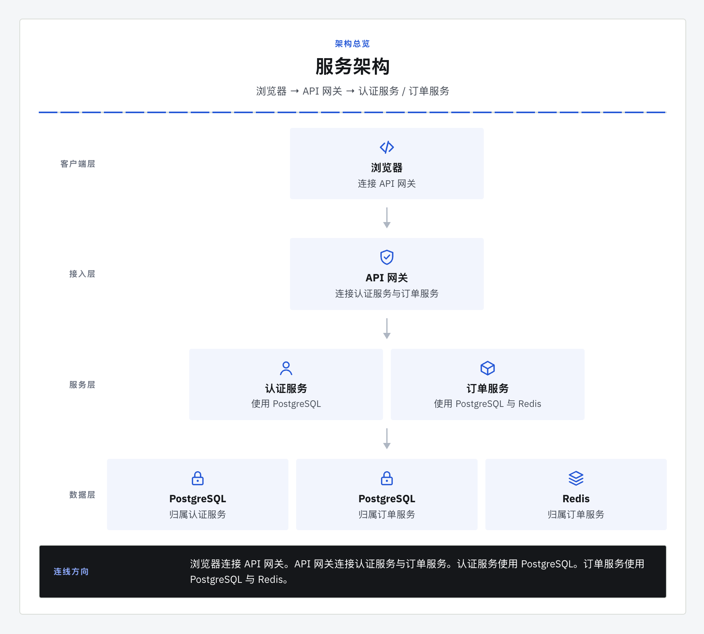
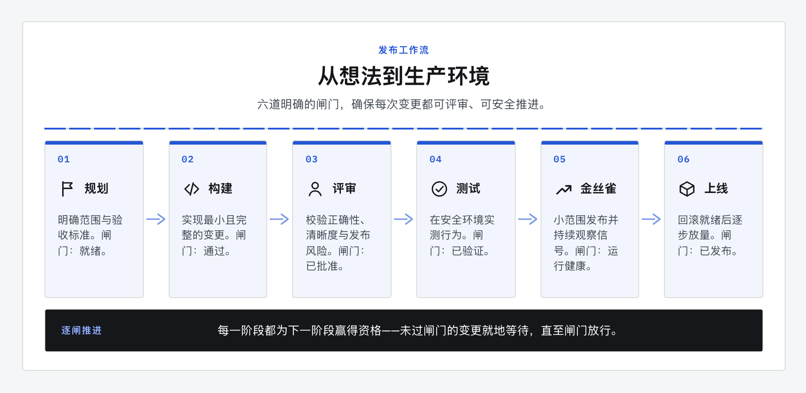
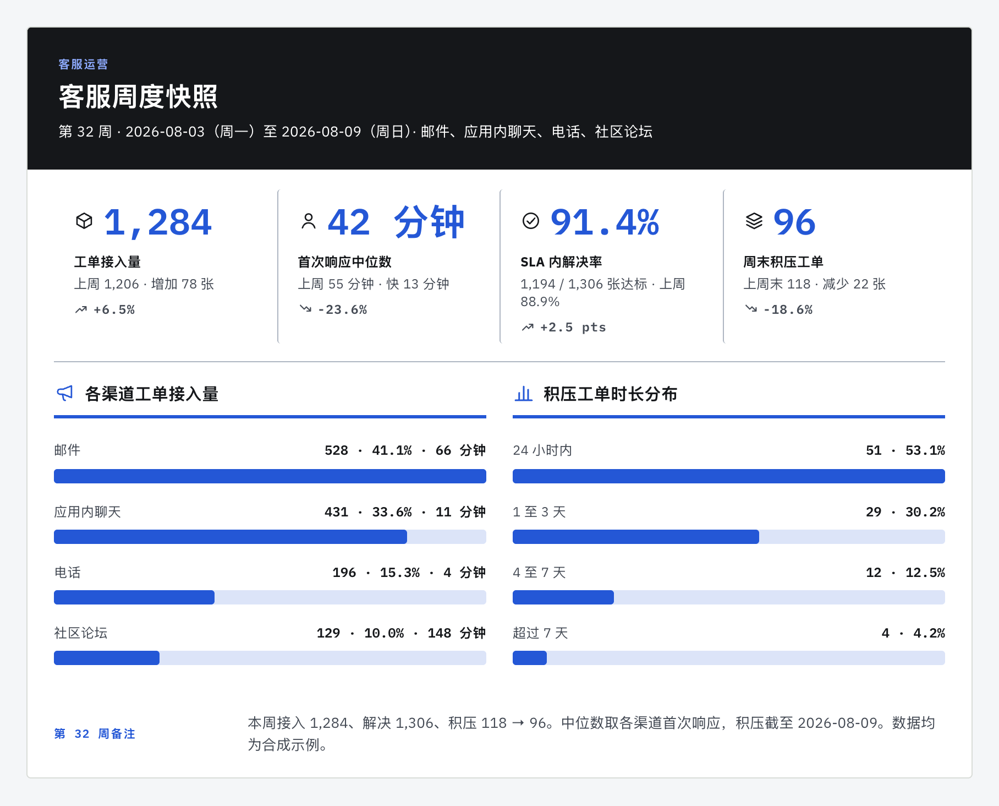
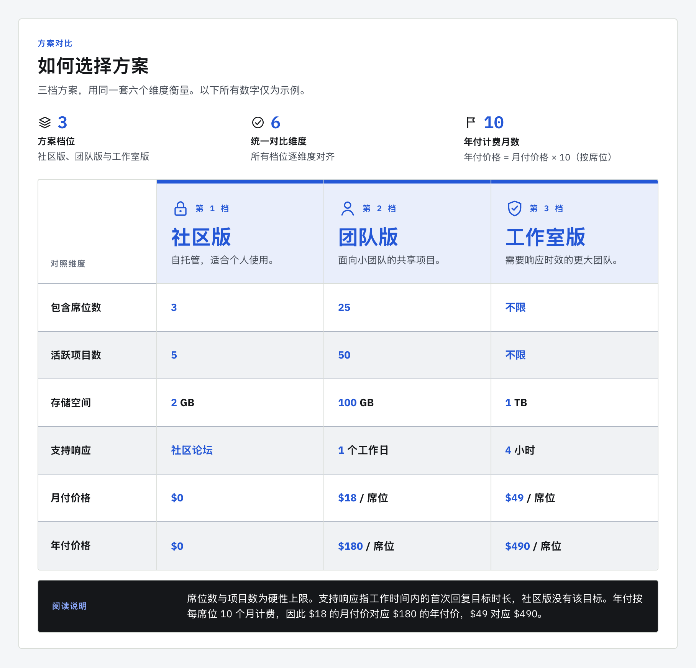
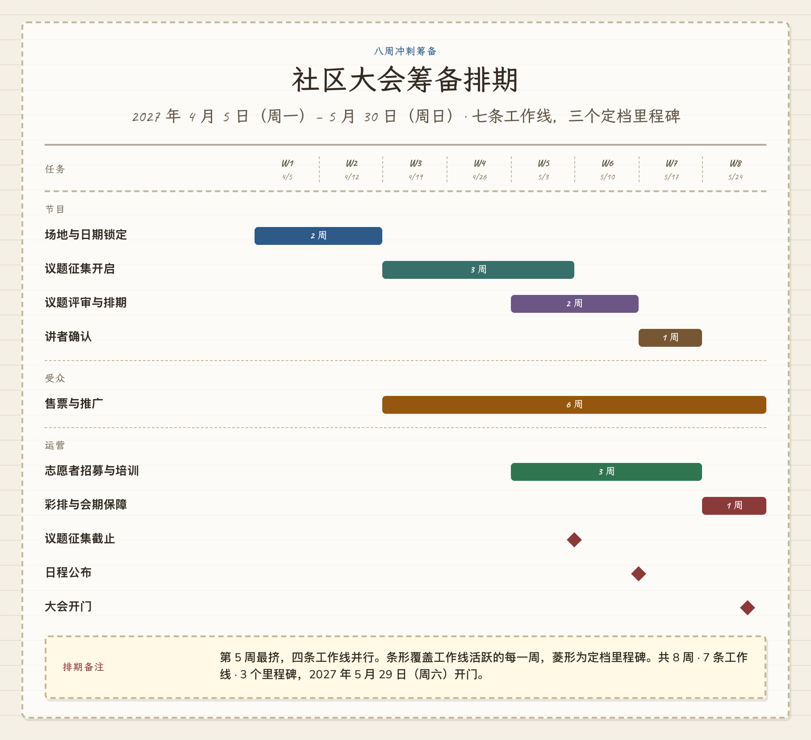

<div align="center">
  
  <p><strong>把一段中文技术说明，变成能放进 README 或 RFC 的图。</strong><br>
  中英文排版 · 独立 HTML · 一句「同时导出 PNG」拿到图片</p>
  <p>
    <a href="./README.md">English</a>
    · <a href="https://godvvvzzz.github.io/text2html2png/zh.html">查看案例</a>
    · <a href="#快速开始">快速开始</a>
    · <a href="#不通过-agent-也能试用渲染器">本地试用</a>
    · <a href="./CONTRIBUTING.md">参与贡献</a>
  </p>
  <p>
    <a href="https://github.com/GODVvVZzz/text2html2png/stargazers"></a>
    <a href="https://github.com/GODVvVZzz/text2html2png/actions/workflows/ci.yml"></a>
    <a href="./LICENSE"></a>
    
  </p>
</div>

一个把系统描述、发布计划和技术笔记做成静态图的 Agent 技能。Agent 整理内容，本地渲染器完成排版、嵌入字体，再用浏览器检查结果。

## 输入一段话，得到系统总览

安装技能后，把下面这段话发给 Agent：

```text
使用 text2html2png，把下面的技术说明做成用于 README 的 clean 风格架构图。
浏览器连接 API 网关，网关连接认证服务和订单服务。
认证服务使用独立的 PostgreSQL；订单服务使用另一套 PostgreSQL 和自己的 Redis。
不要补充云厂商、协议、端口或指标。
保留 HTML 和 Diagram JSON，同时导出 PNG。
```

<div align="center">
  <a href="https://godvvvzzz.github.io/text2html2png/examples/service-architecture-zh.html"></a>
</div>

**[直接打开 HTML](https://godvvvzzz.github.io/text2html2png/examples/service-architecture-zh.html)** · [PNG 图片](./skills/text2html2png/assets/gallery/service-architecture-zh-clean.png) · [完整 Diagram JSON](./docs/examples/service-architecture-zh.diagram.json) · [英文效果](https://godvvvzzz.github.io/text2html2png/examples/service-architecture-en.html)

架构布局用向下箭头连接相邻层，具体依赖由节点说明和页脚表达，适合分层总览。复杂拓扑的任意连线不属于当前能力。提交的 JSON 可以复现这个案例；Agent 对同一段自然语言的组织方式可能不同。

更长的技术说明见[订单事件架构案例](https://godvvvzzz.github.io/text2html2png/examples/order-event-architecture-zh.html)：3 层、9 个节点，保留同步请求、异步事件方向、三套数据库归属与投递边界。[原始需求](./skills/text2html2png/examples/order-event-architecture.meta.json)和[完整 JSON](./docs/examples/order-event-architecture-zh.diagram.json)均公开；这是合成设计案例，不是实际客户系统或性能基准。

## 快速开始

安装技能：

```bash
npx skills add GODVvVZzz/text2html2png -g -y
```

然后把上面的 prompt 发给 Agent，或替换成你的真实内容。也可以明确指定安装目标：

```bash
npx skills add GODVvVZzz/text2html2png -g -a codex -y
npx skills add GODVvVZzz/text2html2png -g -a claude-code -y
```

| 产物 | 什么时候交付 | 怎么使用 |
|---|---|---|
| 独立 `.html` | 默认交付 | 用浏览器打开，或随项目保存 |
| `.png` | 明确说 **「同时导出 PNG」** | 粘贴到 README、RFC、issue、幻灯片或聊天 |
| `.diagram.json` | 随 HTML 保留 | 修改内容、主题，再次渲染 |

需要改图时，让 Agent 修改 JSON 后重新生成。HTML 是可独立打开的产物，JSON 是用于后续修改和复现的源文件。

**环境要求：** 生成 HTML 需要 Node.js 22.12+；工作流要求的浏览器版面检查和可选 PNG 导出还需要本机 Chrome、Chromium、Edge 或 Brave。首次渲染前，Agent 会在已安装的技能目录内运行 `npm ci --omit=dev`，按 lockfile 安装字体、`subset-font`、`puppeteer-core` 等依赖。它使用现有浏览器，不额外下载浏览器。首次安装需要联网。

## 不通过 Agent 也能试用渲染器

**无需安装：** 打开[案例页](https://godvvvzzz.github.io/text2html2png/zh.html)，对照原文与成图、切换中英文，下载 HTML、PNG 和完整 Diagram JSON。这是已生成案例的静态展示页；页面不会调用模型，也不会把新输入的自然语言生成图。

**本地修改：** 克隆仓库、安装依赖并启动 playground：

```bash
git clone https://github.com/GODVvVZzz/text2html2png.git
cd text2html2png/skills/text2html2png
npm ci
npm run playground
```

打开终端打印的地址，选择九种图表中的一个案例，编辑 **Diagram JSON**，预览并下载 HTML 或通过版面检查的 PNG。playground 和渲染器不需要模型 API Key；自然语言理解由你使用的 Agent 完成。

另开一个终端，在 `text2html2png/skills/text2html2png` 目录下复现上面的架构图：

```bash
npm run render -- --input ../../docs/examples/service-architecture-zh.diagram.json --html architecture.html --audit
```

同时导出图片：

```bash
npm run render -- --input ../../docs/examples/service-architecture-zh.diagram.json --html architecture.html --png architecture.png --force
```

`--png` 会先执行严格版面检查。`--force` 明确允许覆盖已有产物；使用新文件名时可省略。如果没有自动找到浏览器，可传入 `--chrome /path/to/browser` 或设置 `CHROME_PATH`。

## 还能做哪些图

|  |  |
|---|---|
| **解释发布流程** · `clean`<br><br>[直接预览 HTML](https://godvvvzzz.github.io/text2html2png/examples/release-flow-zh.html) | **汇报已有指标** · `clean`<br><br>[直接预览 HTML](https://godvvvzzz.github.io/text2html2png/examples/support-snapshot-zh.html) |
| **对齐方案差异** · `clean`<br><br>[直接预览 HTML](https://godvvvzzz.github.io/text2html2png/examples/plan-comparison-zh.html) | **安排上线计划** · `notebook`<br><br>[直接预览 HTML](https://godvvvzzz.github.io/text2html2png/examples/launch-plan-zh.html) |

每个案例都提供中英文源数据。案例数据均为合成数据，见[素材来源说明](./ASSET_PROVENANCE.md)。完整 prompt 和可下载产物见[案例页](https://godvvvzzz.github.io/text2html2png/zh.html)。

| 图表 | 适用场景 |
|---|---|
| 架构图 | 分层系统总览，文字标明具体依赖 |
| 流程图 | 顺序明确的流程、发布闸门 |
| 对比表 | 按同一组标准对齐的多个方案 |
| 时间线 | 里程碑、历史、路线图 |
| KPI 看板 | 你提供的指标与状态数据 |
| 甘特图 | 带日期或工期的任务 |
| 组织架构 | 汇报关系与分类层级 |
| 漏斗 | 你提供的各阶段量级与转化 |
| 叙事长图 | 一页式 PRD、提案、评审说明 |

五套主题：**clean**（默认）、**editorial**、**notebook**、**warm**、**glass**。共享渲染契约支持全部 45 种图表与主题组合。已发布案例覆盖其中一部分；支持某种组合不代表已经建立它的视觉回归基线。

## 输出为什么稳定

```text
你的文字 → Agent → Diagram JSON → 本地渲染器 → HTML → 浏览器检查 → 按需 PNG
```

- **源文件可复现。** 相同 JSON、渲染器和已安装依赖生成相同 HTML。PNG 像素还受浏览器与平台字体栅格化影响。
- **中英文字体随文件保存。** 字体在本机安装，按实际字符取子集后嵌入产物，打开图表不依赖字体 CDN。
- **检查真实排版。** 浏览器检查裁字、遮挡、重叠、不可见文字、连线裁切、过小字号、低对比度，以及中文短标题末尾孤字等换行问题；Agent 还要检查图意和可读性。
- **事实来自输入。** 技能要求保留提供的事实与关系，不补造指标、日期、人员或基础设施。复杂系统仍应对照原文复核结果。

`npm run check:layout` 会重新生成并质检所有已发布案例，warning 和 error 都会让检查失败。每条问题包含元素、量测结果和修复建议；修改 JSON 或共享渲染器后，再运行检查。

完整流程见 [SKILL.md](./skills/text2html2png/SKILL.md)、[Diagram JSON 参考](./skills/text2html2png/references/diagram-json.md)和[渲染契约](./skills/text2html2png/references/rendering-contract.md)。

## 隐私与能力边界

渲染在本机完成，项目没有后端、账号或遥测。浏览器质检和 PNG 导出默认拦截页面网络请求、关闭页面 JavaScript、校验 HTML，并保留 Chrome sandbox。安装依赖会访问你配置的 npm registry。对话内容如何处理，取决于你选择的 Agent 和模型服务；本地渲染不会改变这一点。

详情见 [PRIVACY.md](./PRIVACY.md) 和 [SECURITY.md](./SECURITY.md)。渲染器适用于本工作流生成或你明确信任的 HTML。

| 你的需求 | 使用 |
|---|---|
| 一张放进文档、issue 或聊天的静态图 | **text2html2png** |
| 任意拓扑连线，或可编辑 Mermaid / draw.io / Excalidraw 源文件 | 对应格式的专用工具 |
| 可点击、可探索的交互式系统图 | 交互式图表工具 |
| 统计、科学图表或地图 | 基于真实数据集的可视化库 |
| 交给设计师继续编辑的矢量文件 | 矢量编辑器；目前未实现 SVG 导出 |

## 本地开发

```text
skills/text2html2png/
├── SKILL.md       Agent 工作流与产物契约
├── references/    图表指南、主题、渲染规则
├── schemas/       Diagram JSON 与配置 schema
├── examples/      双语源数据与生成的 HTML
├── scripts/       渲染器、本地 playground、质检和批处理
└── tests/         单元测试与浏览器检查
docs/             静态案例页与可下载产物
```

标准 `skills/` 目录可以通过 `npx skills` 安装。Codex 插件清单复用同一份技能。

从仓库根目录运行：

```bash
cd skills/text2html2png
npm ci
npm run check
```

检查覆盖技能元数据、主题契约、案例结构、隐私模式、安全 HTML、CLI 行为、浏览器截图与版面质检。完整检查需要可启动的浏览器；部分浏览器测试在无可用浏览器时会跳过，因此仅 `npm test` 通过不等于完成视觉验证。

| 命令（在技能目录运行） | 作用 |
|---|---|
| `npm run check:layout` | 重新生成并质检全部已发布案例 |
| `npm run render:examples` | 重新生成案例 HTML 和画廊 PNG |
| `npm run audit:layout -- --html x.html --width 1040 --json` | 按渲染宽度质检单个文档 |
| `node ../../scripts/build-gallery.mjs` | 更新静态案例页、可下载产物和 prompt 索引 |
| `node ../../scripts/check-links.mjs` | 检查本地文档链接 |

可信隔离容器无法启用浏览器 sandbox 时，案例构建器支持 `--no-sandbox`：`node scripts/build-examples.mjs --audit --no-sandbox`。

贡献检查见 [CONTRIBUTING.md](./CONTRIBUTING.md)；实现背景见[验收说明](./docs/ACCEPTANCE.zh-CN.md)和[主题/图表正交性试验](./experiments/theme-decoupling/README.md)。

## 路线图

- 更完整的图表级 JSON 校验与版本迁移工具
- 覆盖更多图表、主题组合的高密度中英文案例
- SVG 导出
- 权利与隐私均已确认的社区作品

## 许可证

MIT，见 [LICENSE](./LICENSE)。
