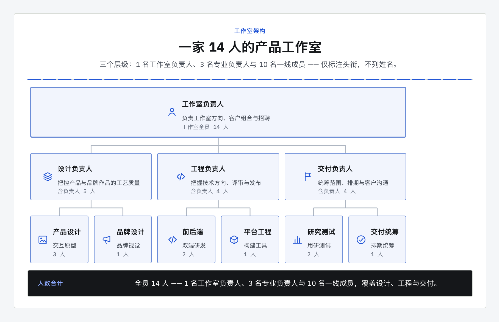
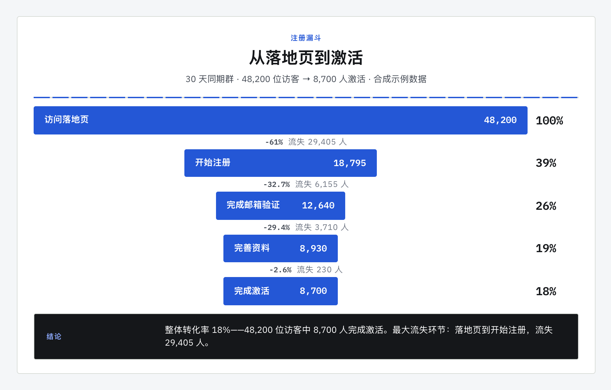

<div align="center">
  
  <p><strong>把结构化文字变成一张能直接粘贴的图。</strong><br>
  Agent 负责理解事实，确定性本地渲染器负责排版、HTML 与按需 PNG。</p>
  <p>
    <a href="./README.md">English</a>
    ·
    <a href="https://godvvvzzz.github.io/text2html2png/">案例画廊</a>
    ·
    <a href="#快速开始">快速开始</a>
    ·
    <a href="#输出为什么稳定">质量如何保证</a>
    ·
    <a href="./CONTRIBUTING.md">参与贡献</a>
  </p>
  <p>
    <a href="https://github.com/GODVvVZzz/text2html2png/stargazers"></a>
    <a href="https://github.com/GODVvVZzz/text2html2png/actions/workflows/ci.yml"></a>
    <a href="./LICENSE"></a>
    
    
  </p>
</div>

<div align="center">
  
</div>

大多数绘图工具要你动手画，这个只要你把事情说清楚。Codex、Claude 或其他兼容 Agent 把内容整理成版本化 Diagram JSON；内置渲染器统一负责布局、字体、安全、HTML 与 PNG。同一份 JSON 会生成同一份 HTML，不再依赖 Agent 临场手写 CSS。

- **先解决三个任务** — 解释系统、发布版本、汇报变化
- **确定性内核** — Agent、案例与 CI 共用一份版本化 JSON 和一个渲染入口
- **9 种图表、5 套视觉主题** — clean 是默认；内容需要氛围时仍可选择 warm 和 glass
- **一张图能直接粘贴,一份文档能留下来** — 交付物是一份可编辑的 HTML 文件;说一句“同时导出 PNG”或传 `--png`,就能拿到图本身
- **质量是量出来的,不是赌出来的** — 基于浏览器的版面质检既是工作流的必经步骤,也是每个已发布示例的 CI 门禁
- **本机优先** — 无托管渲染 API、无 API Key、无遥测,渲染期间网络全部拦截

## 快速开始

```bash
npx skills add GODVvVZzz/text2html2png -g -y
```

然后用自然语言提出需求:

> 把我们的上线计划做成甘特图:调研第 1–2 周,设计第 2–4 周,开发第 4–7 周,内测第 8 周。用 notebook 风格。

图表以一份可编辑的 `.html` 交付——改样式、改文案、进 Git 都行。说一句“顺便导出 PNG”或传 `--png`,就能同时拿到能直接粘贴的图。

已有 Diagram JSON 时，无需 Agent 也能渲染：

```bash
cd skills/text2html2png
npm run render -- --input examples/release-flow.diagram.json --html release.html --audit
```

`skills` CLI 会按你指定的 agent 放置技能。指定单个 agent:

```bash
npx skills add GODVvVZzz/text2html2png -g -a codex -y
npx skills add GODVvVZzz/text2html2png -g -a claude-code -y
```

**环境要求:** 浏览器版面质检或按需导出 PNG 时,需要 Node.js 22.12+ 和任意 Chrome 系浏览器(Chrome、Chromium、Edge 或 Brave)。首次执行浏览器检查时,技能会在自己的目录里安装唯一的直接依赖 `puppeteer-core`(由提交的 lockfile 锁定版本)。它驱动你已装好的浏览器,不会额外下载浏览器。

## 三个招牌场景

本地交互试用：在 `skills/text2html2png` 运行 `npm run playground`，打开打印的地址即可修改案例、预览和下载。[阶段 1 与阶段 2 验收说明](./docs/ACCEPTANCE.zh-CN.md)。

- **解释系统** — 用于 README、RFC 和技术评审的架构图。
- **发布版本** — 顺序明确的发布闸门、路线图和上线计划。
- **汇报变化** — 只使用已提供数据的 KPI 快照和运营周报。

## 浏览更多案例

<div align="center">
  
</div>

上面每一帧都是仓库里真实提交的示例,不是效果图。完整案例(含产出它的原始 prompt)在 **[案例画廊](https://godvvvzzz.github.io/text2html2png/)**。

|  |  |
|---|---|
| **甘特图** · `notebook`<br><br>[Prompt 与 HTML](./skills/text2html2png/examples/launch-plan-zh.html) | **KPI 看板** · `clean`<br><br>[Prompt 与 HTML](./skills/text2html2png/examples/support-snapshot-zh.html) |
| **组织架构** · `clean`<br><br>[Prompt 与 HTML](./skills/text2html2png/examples/studio-org-zh.html) | **漏斗** · `clean`<br><br>[Prompt 与 HTML](./skills/text2html2png/examples/signup-funnel-zh.html) |

另外还有:[clean 发布流程图](./skills/text2html2png/examples/release-flow-zh.html)、[editorial 路线图时间线](./skills/text2html2png/examples/library-roadmap-zh.html)、[clean 方案对比表](./skills/text2html2png/examples/plan-comparison-zh.html),两张架构图 —— [clean 服务拓扑](./skills/text2html2png/examples/service-architecture-zh.html) 和 [editorial 视角下的技能自身流水线](./skills/text2html2png/examples/local-first-pipeline-zh.html),以及把整份产品说明排成一页的 [clean 叙事长图](./skills/text2html2png/examples/cafe-membership-zh.html)。每个示例都同时提供英文版;所有示例数据均为合成数据,见[素材来源说明](./ASSET_PROVENANCE.md)。

## 图表类型

| 图表 | 适用场景 |
|---|---|
| 流程图 | 流程、操作手册、决策路径 |
| 对比 | 按同一组标准对齐的多个方案 |
| 时间线 | 里程碑、历史、路线图 |
| 架构图 | 组件、边界、依赖关系 |
| KPI 看板 | 你提供的指标与状态数据 |
| 甘特图 | 带日期或工期的任务 |
| 组织架构 | 汇报关系与分类层级 |
| 漏斗 | 你提供的各阶段量级与转化 |
| 叙事长图 | 决策先行的图文说明:PRD、方案、复盘 |

任意图表都可以搭配任意风格。统一的 style token contract 在 CI 中校验 5 套风格必须定义同样的 19 个 token,所以「甘特图 + warm」是被支持的请求,而不是碰运气。45 种组合中有 10 种已作为渲染示例发布,其余由 contract 保证兼容,但尚未纳入视觉回归。

## 输出为什么稳定

即使 HTML 由确定性渲染器生成，真实字体与浏览器布局仍可能暴露问题。因此技能会在交付前测量渲染结果，对源码校验看不到的缺陷直接判失败：

```bash
cd skills/text2html2png
node scripts/audit-layout.mjs --html /path/to/diagram.html --width 1040
```

| 规则 | 级别 | 拦住什么 |
|---|---|---|
| `CAPTURE_ROOT_MISSING` | error | 没有可测量和截取的唯一根元素 |
| `CONTENT_OUT_OF_BOUNDS` | error | 元素超出截图区域,会被静默裁掉 |
| `TEXT_CLIPPED` | error | overflow 把读者需要的文字裁掉了 |
| `TEXT_TRUNCATED` | error | 省略号或行数限制藏掉了你的事实 |
| `TEXT_OCCLUDED` | error | 文字被不透明元素压住,图里根本看不到 |
| `TEXT_INVISIBLE` | error | 文字颜色与背景过于接近,等于消失 |
| `SVG_CLIPPED` | error | 连线或箭头跑出 `viewBox`,箭尖被切 |
| `FONT_TOO_SMALL` | error | 实际渲染字号小于 10px |
| `FONT_SMALL_FOR_PROSE` | warning | 正文字号小于 12px |
| `LOW_CONTRAST` | warning | 对比度低于该字号的 WCAG 要求 |
| `TEXT_OVERLAP` | warning | 两处文字互相重叠 |
| `EMPTY_FILLER` | warning | 有装饰但没有内容的空盒子 |
| `ARIA_HIDDEN_TEXT` | warning | 可见但屏幕阅读器永远读不到的文字 |
| `EXTREME_ASPECT_RATIO` | warning | 画布过宽或过高,难以阅读 |

每条结论都会给出具体元素、量测证据和一条明确的修法,让 agent 去改文档而不是瞎猜。`npm run check:layout` 以 `--strict` 模式跑完全部 10 个已发布示例,warning 与 error 一样会让构建失败。

这不是摆设:这项检查在本仓库原本已认为完工的示例里查出了真实缺陷 —— 一个有 9px 的文字,一个白字只有 3.2:1 对比度,还有一个图例被 aria-hidden 挡住了屏幕阅读器;它曾经存在的漏报(文字被压住、文字隐形)现在都有测试 fixture 覆盖。

技能会直接完成图表类型、布局和风格等表现决策，但不会虚构指标、日期、人员或依赖关系。缺少的事实会被省略或明确标注，而不是伪装成用户提供的信息。

## 隐私与安全

浏览器版面质检与按需 PNG 导出行为:

- 校验生成文档中的严格 Content Security Policy;
- 拒绝脚本、事件属性、iframe、form、插件和 `javascript:` URL;
- 拦截页面发起的全部网络请求,包括远程字体和图片;
- 关闭页面 JavaScript;
- 保留 Chrome sandbox;
- 未显式传入 `--force` 时拒绝覆盖已存在的 PNG;
- 限制尺寸与总渲染像素。

能直接粘贴的图只在你开口时才渲染;在那之前,内容始终是一份留在磁盘上的可编辑 HTML 文件。

只有确实需要远程素材时才使用 `--allow-network`。只有在可信的隔离容器内才使用 `--no-sandbox`。渲染来源不可信的 HTML 前请先读 [SECURITY.md](./SECURITY.md);想确认什么会、什么不会离开本机,请看 [PRIVACY.md](./PRIVACY.md)。

## 什么时候该用别的工具

把边界说清楚,比声称什么都能做更有用:

| 你的需求 | 更合适的选择 |
|---|---|
| 图表源码进 Git、能清晰 diff | Mermaid、D2 或 PlantUML |
| 可点击、可探索的交互式系统图 | 交互式图表工具 |
| 统计/科学图表或地图 | 基于真实数据集的可视化库 |
| 交给设计师继续编辑的矢量文件 | 矢量编辑器 |
| 一张能直接贴进文档、幻灯片、issue 或聊天的精致静态图 | **这个技能** |

如果你要的是 Mermaid、draw.io、Excalidraw 或可编辑 SVG,技能会明确让你去用对应工具,而不是产出一个更差的替代品。

## 仓库结构

```text
.
├── .codex-plugin/plugin.json     Codex 插件清单
├── assets/                       品牌标识、社交分享卡、demo 动图
├── docs/                         已发布的案例画廊
├── skills/text2html2png/
│   ├── SKILL.md                  agent 读取的技能契约
│   ├── references/               9 份图表指南、5 套风格系统、共享契约
│   ├── examples/                 10 个双语示例:每种语言一份 HTML + fixture
│   ├── scripts/                  渲染、校验、质检、批处理工具
│   └── tests/                    含真实 Chrome 冒烟测试
└── .github/                      CI、issue 与 PR 模板
```

标准 `skills/` 目录结构可直接被 `npx skills` 使用。Codex 插件清单复用同一份技能,不做重复拷贝。

## 本地开发

```bash
cd skills/text2html2png
npm ci
npm run check
```

`npm run check` 覆盖技能元数据、5 套风格的 token contract、示例 manifest、公开仓库隐私模式扫描、安全 HTML 校验、CLI 参数处理、真实 Chrome 截图,以及全部已发布示例的版面质检。

常用单项命令:

| 命令 | 作用 |
|---|---|
| `npm run render:examples` | 从提交的 HTML 重新渲染全部画廊 PNG |
| `npm run check:layout` | 按记录的宽度质检每个示例 |
| `npm run audit:layout -- --html x.html --width 1040 --json` | 质检单个文档,输出机器可读结果 |
| `node ../../scripts/build-gallery.mjs` | 重新生成画廊页与 prompt 索引 |

已验证的[主题/图表正交性试验](./experiments/theme-decoupling/README.md)使用同一份 comparison 结构生成中英文五套主题。试验 PNG 只用于开发评审；正常调用交付的是可编辑 HTML，只有你开口时才渲染 PNG。

## 路线图

- 更完整的图表级 JSON 校验与版本迁移工具
- SVG 导出
- 针对 CJK 文本、超长标签和更多图表/风格组合的视觉回归基线
- 权利与隐私均已确认的社区作品画廊

新增示例需要达到的质量与隐私标准见 [CONTRIBUTING.md](./CONTRIBUTING.md)。

## 许可证

MIT,见 [LICENSE](./LICENSE)。

如果它帮你省下了一趟画图工具,点个 star 能让更多人找到它。
